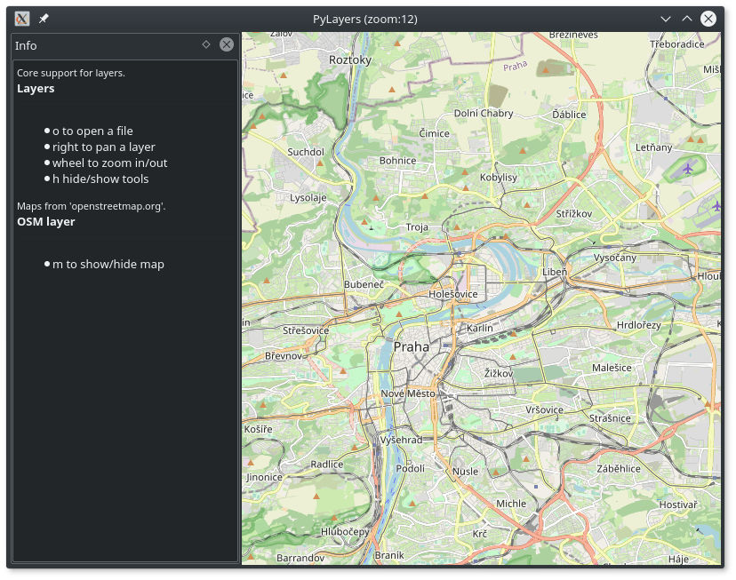
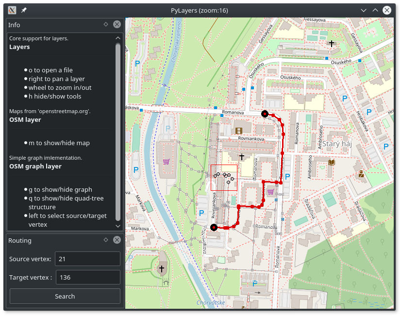

# pylayers

Layer based visualization framework for experimental geodata and search algorithms visualisation.

> install dependencies with `sudo apt install python-qt4-dev pyqt4-dev-tools` command


## OSM layer

OSM (Open Street Map) layer integration into pylayers framework (serves as a base for other layers).

Run with 

```bash
cd osm_layer
python pylayers.py
```

commands.




## bidirectional dijkstra layer

Bidirectional dijkstra based route calculation layer.

Run with

```bash
cd bidi_dijkstra
python pylayers.py
```

commands a open `test/data/romanova.bgrp` bidirectional graph file by pressing `o` key.



> What about graph generator? Make a note about it.


## dijkstra layer

Dijkstra based route calculation layer.

Run with

```bash
cd dijkstra
python pylayers.py
```

commands.


## location layer

Layer to visualize line based gps log file.

> describe log file structure


## custom layer

> a few lines how to implement new layer 

